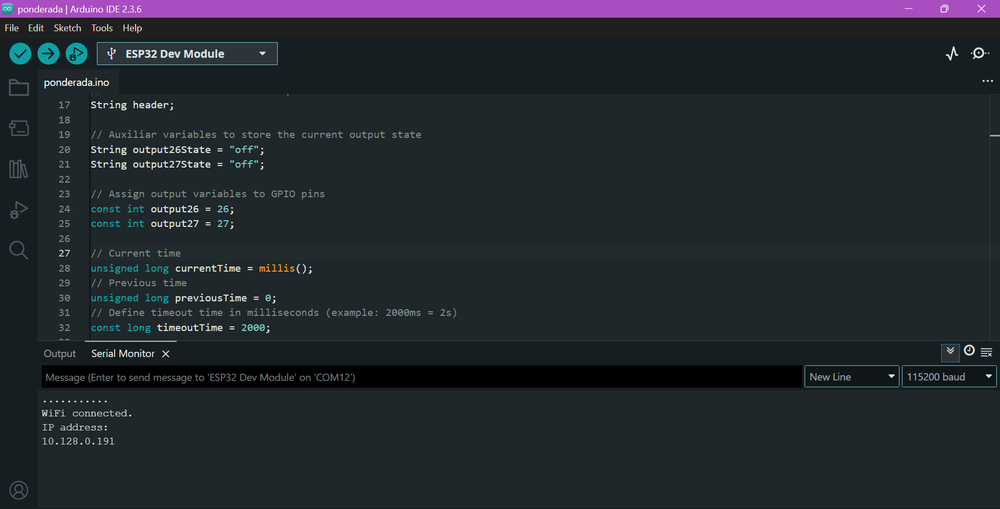
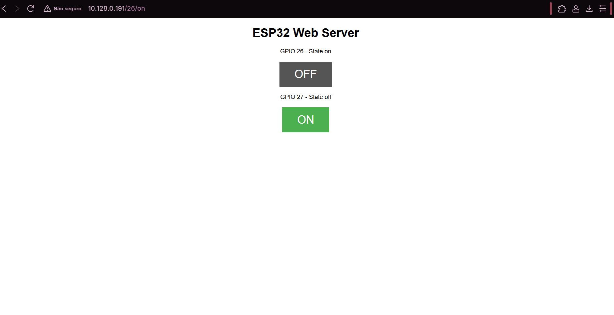

# Segurança em IoT

## Identificação de vulnerabilidades
Ao realizar a leitura do código, presente em `ponderada.ino` (análise estática), identificam-se imediatamente os seguintes pontos críticos de segurança:

- Wifi exposto: as variáveis `ssid` e `password` estão expostas diretamente no código-fonte. Como esse código foi publicado em um repositório público no github, ou se o binário do ESP32 for extraído (dump de firmware), as credenciais da rede Wi-Fi do inteli ("Inteli.Iot") estarão comprometidas:

```cpp
// Replace with your network credentials
const char* ssid = "Inteli.Iot";
const char* password = "%(Yk(sxGMtvFEs.3";
```

- Comunicação não criptografada: o código usa `WiFiServer(80)`, que opera o protocolo HTTP padrão, e não o HTTPS, que adicionaria segurança. Todo o tráfego, incluindo o conteúdo da página HTML e as requisições de controle `(GET /26/on)`, trafega em texto plano, ou seja, sem confidencialidade.

- Ausência de autenticação: não existe verificação de login, senha ou token. Qualquer dispositivo conectado à mesma rede Wi-Fi que descobrir o endereço IP do ESP32 pode acessar a interface web e controlar os GPIOs (neste caso, LEDs, mas poderiam ser motores ou travas, que poderiam comprometer o funcionamento de um protótipo físico mais robusto).

```cpp
// Set web server port number to 80
WiFiServer server(80);

// Variable to store the HTTP request
String header;
```

- Gerenciamento de Memória Inseguro (Risco de DoS): A linha header `+= c;` concatena caracteres recebidos na String header sem verificar um limite máximo de tamanho. Um atacante pode enviar uma requisição HTTP infinitamente longa (como vários gigabytes de headers falsos) até estourar a memória RAM do ESP32, causando travamento ou reinicialização.

```cpp
else if (c != '\r') {  // if you got anything else but a carriage return character,
          currentLine += c;      // add it to the end of the currentLine
        }
```

## Cenários de ataque detalhados
Abaixo, são descritos dois ataques baseados nas vulnerabilidades de comunicação não criptografada e acesso não autorizado.

### Ataque 01: eavesdropping

Este ataque explora a falta de criptografia (uso de HTTP ao invés de HTTPS). Tem alta probabilidade de ocorrência, pois as ferramentas para fazer esse ataque são gratuitas e fáceis de usar. Em redes Wi-Fi compartilhadas, é bem fácil "ouvir" (eavesdropping) o tráfego não criptografado.

Neste código específico, o atacante descobre apenas o estado dos LEDs, por ser um sistema muito simples. Porém, se houvesse envio de dados sensíveis (como leitura de um sensor de temperatura crítico ou inputs de senha), a confidencialidade seria totalmente violada, ou seja, o risco resultante é alto.

*Passo a passo:*

1. Acesso à Rede: o atacante conecta-se à mesma rede Wi-Fi (`Inteli.Iot`) usando um laptop ou smartphone.

2. Configuração: o atacante executa uma ferramenta de captura de pacotes (como Wireshark) e coloca sua placa de rede em "modo promíscuo" (ou realiza um ataque de ARP Spoofing para forçar o tráfego da vítima a passar por ele).

3. Captura: o atacante aguarda que um usuário legítimo acesse o painel de controle do ESP32 para ligar um LED.

4. Análise: O Wireshark captura os pacotes TCP/IP. Como não há SSL/TLS, o atacante usa um filtro (como o http) e consegue ler claramente o conteúdo: `GET /26/on` e a resposta HTML do servidor.

### Ataque 02: acesso não autorizado

Este ataque explora a ausência total de mecanismos de autenticação. Tem probabilidade muito alta, pois não requer conhecimento técnico avançado, já que basta saber o IP, ou seja, não há barreiras a serem quebradas. Como este código geralmente é base para códigos de automação IoT (como abrir um portão eletrônico), o impacto de um terceiro controlar isso é crítico, podendo causar danos físicos ou brechas de segurança física. O risco é máximo porque qualquer pessoa na rede se torna um administrador do dispositivo.

*Passo a passo:*

1. Reconhecimento: o atacante, já na rede, utiliza uma ferramenta como o nmap ou Angry IP Scanner para varrer a rede em busca de dispositivos com a porta 80 aberta.

2. Identificação: o atacante encontra o IP do ESP32 (como `192.168.1.50`).

3. Exploração: o atacante digita esse IP no navegador do seu próprio celular.

4. Ação: o painel de controle abre imediatamente. O atacante clica em "ON" e "OFF", controlando os atuadores físicos sem o consentimento do dono. Ele pode também criar um script simples em Python para enviar comandos repetitivos (`curl http://192.168.1.50/26/off`), impedindo que o usuário legítimo mantenha a luz dos leds ligada.

## Próximos passos para mitigar essas vulnerabilidades

Para corrigir esses riscos, pode-se:

1. Não deixar senha do Wi-Fi no código (usar bibliotecas como WiFiManager).

2. Implementar uma camada de autenticação simples (verificar login/senha antes de processar o GET).

3. Limitar o tamanho da string header para evitar estouro de memória.

## Ataque realizado

O IP do ESP32 pôde ser descoberto pelo monitor Serial, conforme a figura abaixo. Com isso, descobrimos que o IP do nosso ESP32 era `10.128.0.191`.

<div align="center">
<sub>Figura 01: Monitor Serial.</sub>
</div>
<div align="center">

</div>

<div align="center">
<sub>Fonte: material produzido pela equipe, 2025.</sub>
</div>

O Website pode ser visto na figura abaixo.

<div align="center">
<sub>Figura 02: Website.</sub>
</div>
<div align="center">

</div>

<div align="center">
<sub>Fonte: material produzido pela equipe, 2025.</sub>
</div>

Realizamos um ataque ao nosso sistema, se aproveitando da vulnerabilidade da falta de uma autenticação. O vídeo do ataque sendo realizado pode ser visto [aqui](https://drive.google.com/file/d/1iiFOfI65mCJ5bhBkQz8DKTxWqLFvNQAX/view?usp=sharing).

Nesse ataque, uma pessoa não autorizada entrou no sistema utilizando os site `http://10.128.0.191/26/off` e `http://10.128.0.191/26/on`. Se o IP do ESP32 for descoberto, esse site pode ser facilmente acessado, controlando os LEDs de forma remota.


